# ☀ Front-end do modclima

1. Listagem das usinas
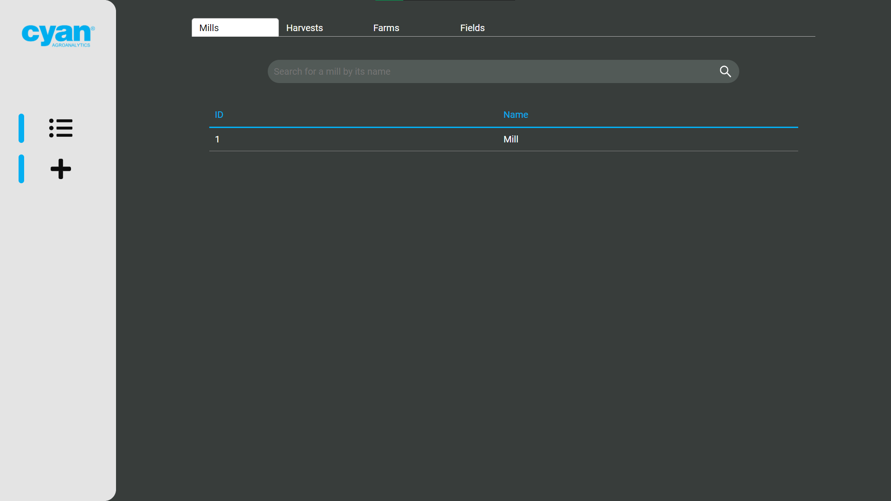
2. Listagem das safras
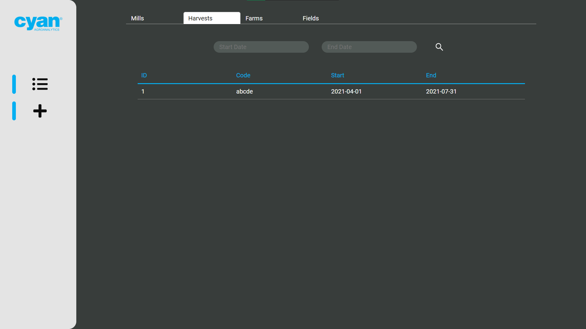
3. Listagem das fazendas
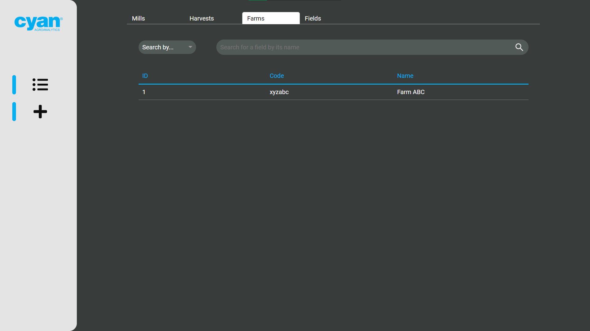
4. Listagem dos talhões
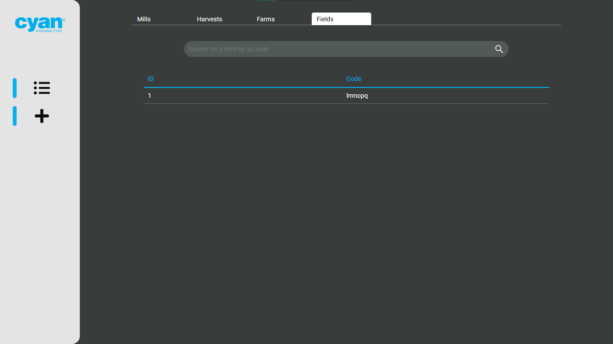
5. Tela onde deseja selecionar o que será cadastrado
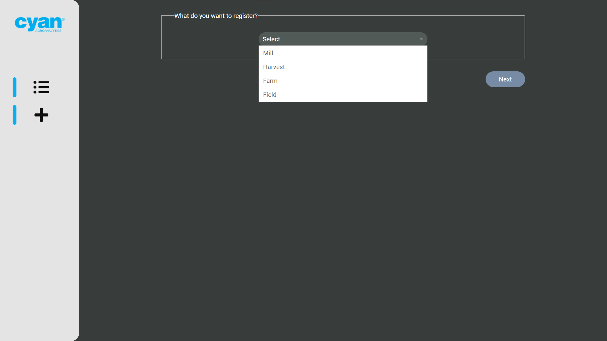
6. Ao selecionar safras, fazendas ou talhões deverá ser escolhido à quem ele irá fazer referência.
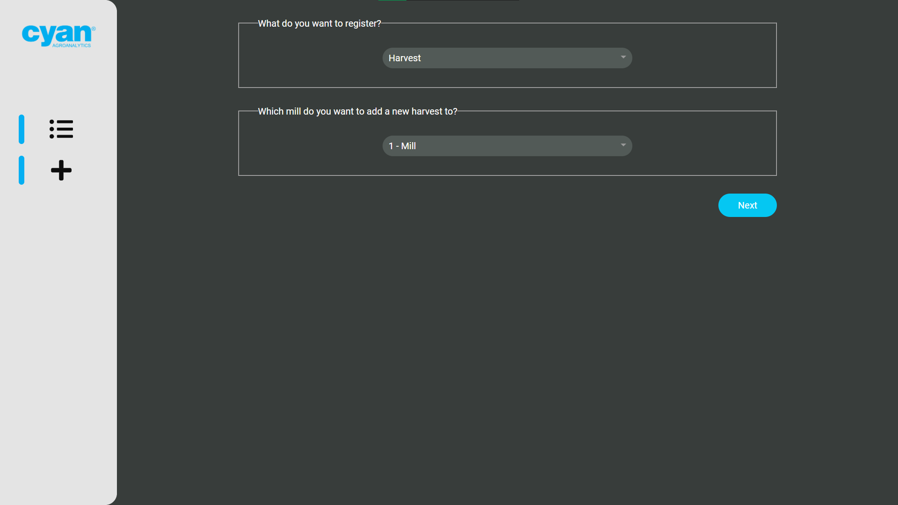
8. Antes de informar o código do talhão que irá cadastrar, deverá selecionar o local no mapa
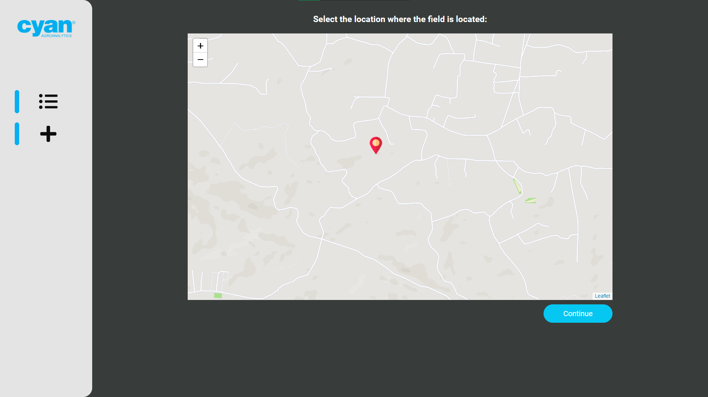
9. Modelo que as telas com input seguem

10. Notificação ao registar um elemento
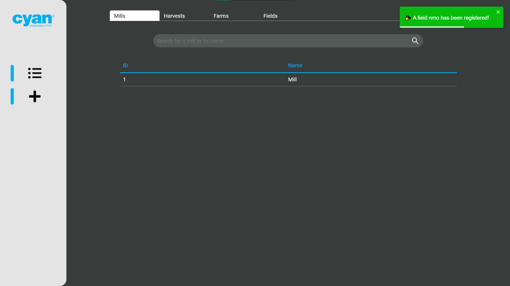
11. Detalhes de uma usina
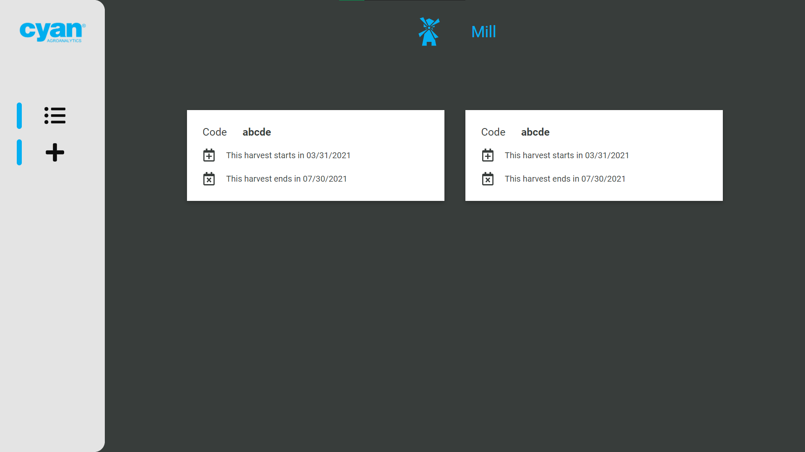
12. Detalhes de uma safra
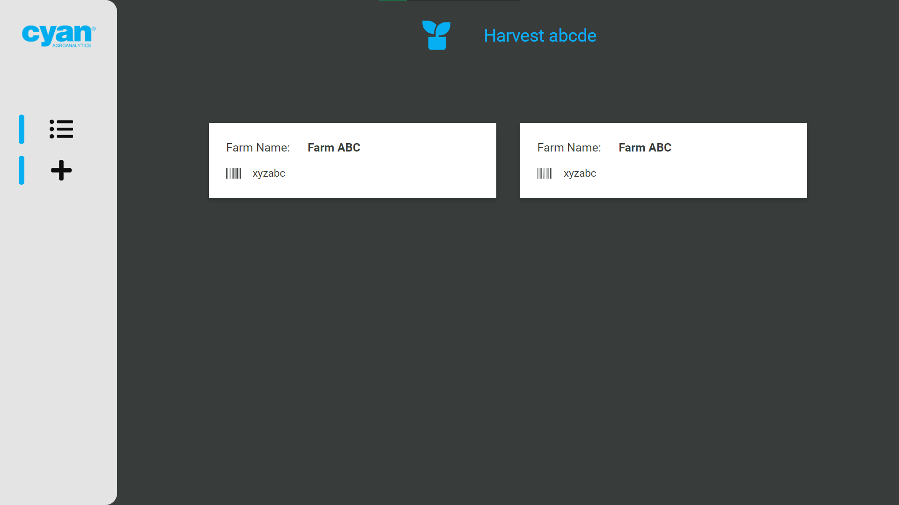
14. Detalhes de uma fazenda
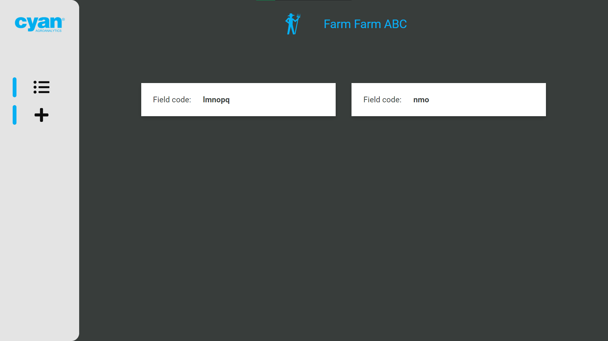
15. Detalhes de um talhão
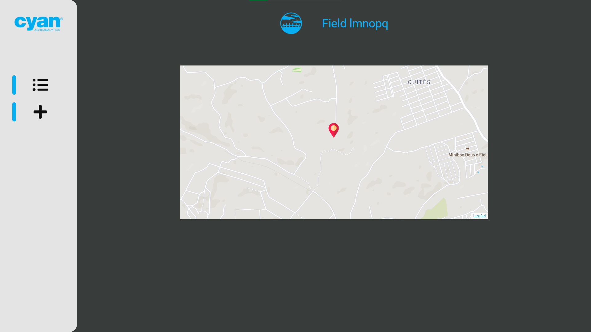